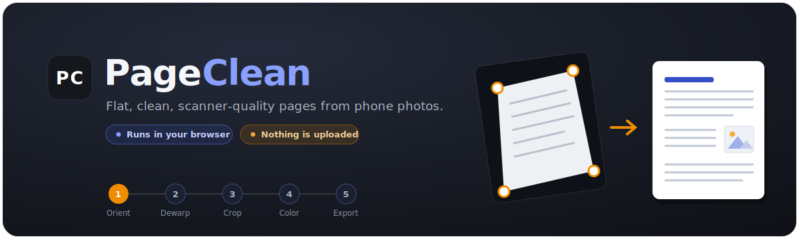

<p align="center">
  
</p>

<p align="center">
  <a href="LICENSE"></a>
  <a href="https://github.com/AOShei/Page_Clean/stargazers"></a>
  <a href="https://github.com/AOShei/Page_Clean/commits"></a>
  <a href="https://github.com/AOShei/Page_Clean/issues"></a>
  
  
</p>

<p align="center">
  <b>PageClean</b> turns sloppy phone photos of document pages into clean, flat, scanner-quality output —
  rotate, de-skew, crop, threshold, and export to a standard page size. One HTML file, no install, nothing uploaded.
</p>

---

## Why

Phone photos of paper are quick to take but ugly to use: they're tilted, shot at an angle, lit unevenly, and surrounded by desk clutter. Desktop tools like ScanTailor do a beautiful job but are fiddly to install and share. PageClean is a single, self-contained web page that does the essential cleanup in your browser, so you can hand it to anyone — they just open the file. It's especially handy for **sheet music**, where clean, high-resolution black‑and‑white output matters.

## Features

- **Five-step pipeline** — Orient → Dewarp → Crop & fill → Color → Export, with a live preview at every step.
- **Perspective dewarp** — drag the four page corners to flatten a photo shot at an angle. Corners can sit **past the edge of the photo**, so pages that are clipped by the frame still rectify correctly (the missing area fills with your chosen background).
- **Optional curl correction** — for pages that aren't flat (e.g. a book that rolls near the binding), bend four edge handles to straighten bowed edges.
- **Smart cropping with hole-fill** — pull the crop box *beyond* the page to add clean, background-filled margins instead of cutting content off. Pick the background color or sample it from the page.
- **Black & white that stays sharp** — adaptive thresholding handles uneven lighting; an **anti-alias** mode thresholds at full resolution and down-samples with area averaging, so staff lines and thin strokes don't turn into jagged staircases.
- **Flexible export** — A3 / A4 / A5 / US Letter / US Legal or fit-to-image, auto/portrait/landscape, 150–600 dpi, with adjustable page margins. Save as **PDF, PNG, or JPG**.
- **Private by design** — 100% client-side. No account, no upload, no telemetry. Your images never leave your device.
- **Zero install** — it's one HTML file. Open it locally, host it anywhere static, or run it from a USB stick.

## The pipeline

| Step | What it does |
|------|--------------|
| **1 · Orient** | Rotate the page upright (90° steps + a fine-tilt nudge). |
| **2 · Dewarp** | Square up perspective from a four-corner selection; optionally flatten page curl. |
| **3 · Crop & fill** | Set the final boundary and add background-filled margins; choose or sample the fill color. |
| **4 · Color** | B&W adaptive, B&W threshold (Otsu), grayscale, or color — with brightness, contrast, detail size, and ink threshold. |
| **5 · Export** | Place onto a standard page size at your chosen resolution and save as PDF / PNG / JPG. |

## Quick start

**Option A — just open it.** Download `index.html` and double-click it. That's the whole app.

**Option B — host it (e.g. GitHub Pages).** Put the repository on GitHub and enable **Settings → Pages**, serving from the repo root. Because the app is named `index.html`, the Pages URL loads it directly.

**Option C — run a local server** (optional, only if your browser restricts file access):

```bash
# from the repo folder
python3 -m http.server 8000
# then visit http://localhost:8000/
```

> The first load fetches the OpenCV image engine (~8 MB) and the jsPDF library from a CDN, then the browser caches them. See **Offline use** below to bundle them.

## Tips for the best results

- **Sheet music / fine line art:** use **B&W · adaptive**, keep **Smooth edges (anti-alias)** on, and export at a high resolution (**600 dpi**) or **Fit to image** so nothing is down-scaled.
- **Uneven lighting / shadows:** B&W adaptive almost always beats a single global threshold. If the background speckles, raise the **ink threshold**; if small text looks mushy, lower the **detail size**.
- **A page clipped by the photo frame:** in **Dewarp**, drag the affected corner *outside* the image onto where the real corner would be — the gap fills with the background.
- **Margins / page numbers near the edge:** in **Crop & fill**, drag the box slightly past the page so nothing important is trimmed.

## Offline use

PageClean works without a network connection once the engine is available locally:

1. Download `opencv.js` and place it next to `index.html`.
2. Open `index.html` and set the engine source near the top of the file:
   ```js
   const OPENCV_URLS = ["opencv.js"]; // local copy, no CDN needed
   ```
3. (PDF export) Download `jspdf.umd.min.js` and point the `<script>` tag at your local copy.

## How it works

PageClean is a single HTML document with inline CSS and JavaScript. Image processing runs on [**OpenCV.js**](https://docs.opencv.org/) (OpenCV compiled to WebAssembly); PDF export uses [**jsPDF**](https://github.com/parallax/jsPDF). The pipeline is non-destructive — each stage is cached and re-derived from the original at full resolution on export, so the interactive preview stays fast while the saved file keeps every pixel.

## Browser support

Works in current versions of Chrome, Edge, Firefox, and Safari (desktop and mobile). It requires WebAssembly, which all modern browsers support. Very large images need a fair amount of memory; if a huge photo struggles, lower the export resolution.

## Known limitations

- **Curl correction is experimental.** It straightens bowed *edges*; it does not yet correct independent waviness in the page interior. Leaving the edges straight reproduces the exact flat-page perspective result.
- **First load needs internet** (to fetch the engine), unless you bundle it as described in *Offline use*.
- Auto edge-detection is a convenience, not magic — always glance at the corners before continuing.

## Contributing

Issues and pull requests are welcome. Because the app is a single file, hacking on it is simple: edit `index.html` and refresh the browser — there's no build step or toolchain. Bug reports are most useful with a sample photo (or a description of one) and the step where things went wrong.

## License

PageClean is released under the **GNU General Public License v3.0**. See [`LICENSE`](LICENSE) for details. In short: you're free to use, study, share, and modify it, provided derivative works remain under the same license.

## Acknowledgements

- [OpenCV](https://opencv.org/) and the OpenCV.js project — the image-processing engine.
- [jsPDF](https://github.com/parallax/jsPDF) — PDF generation in the browser.
- Inspired by the workflow of [ScanTailor](https://scantailor.org/).
